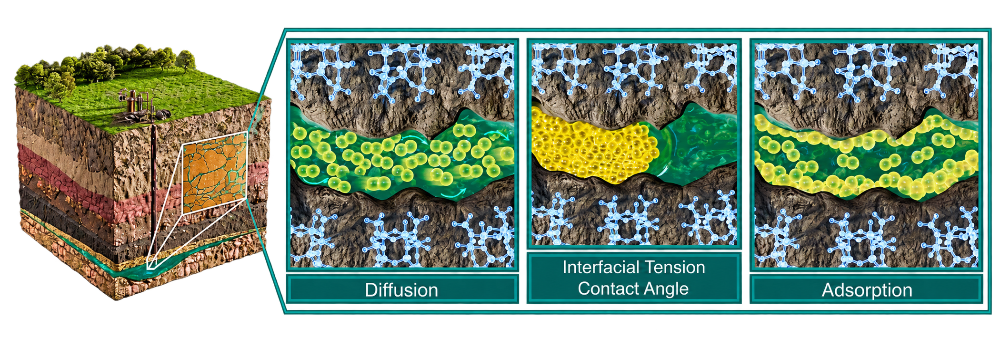

  

# Molecular Simulations for Subsurface Engineering (MSSE) 2026

Official materials repository for the **Molecular Simulations for Subsurface Engineering (MSSE)** online summer school.

- **Dates:** 1–4 September 2026
- **Format:** Online
- **Audience:** Graduate students and early-career researchers in academia and industry
- **Website and application:** [msse-hub.com](https://www.msse-hub.com/)

The school combines invited research lectures, tutorials, and guided computational exercises on classical molecular modelling for subsurface engineering and energy systems.

## Learning outcomes

Participants will develop an understanding of:

- molecular simulation fundamentals;
- fluid–rock interactions and interfacial phenomena in porous media;
- transport, diffusion, and confinement effects;
- simulation-data analysis for subsurface systems;
- links between molecular mechanisms and reservoir-scale processes; and
- good practice for setting up, running, and validating simulations.

## Programme at a glance

| Day | Date | Theme | Materials |
| --- | --- | --- | --- |
| 1 | 1 September | Introduction to Molecular Simulations for Subsurface Engineering | [Day 1](01_Research-Led-Presentations/day-01-introduction/) |
| 2 | 2 September | Interfacial Phenomena in Subsurface Systems | [Day 2](01_Research-Led-Presentations/day-02-interfaces/) |
| 3 | 3 September | Rock–Fluid Interactions at Nanoscale under Reservoir Conditions | [Day 3](01_Research-Led-Presentations/day-03-rock-fluid/) |
| 4 | 4 September | Transport Phenomena in Bulk and Confinement | [Day 4](01_Research-Led-Presentations/day-04-transport/) |

See the [programme](SCHEDULE.md), [speaker list](SPEAKERS.md), and [research-led presentation index](01_Research-Led-Presentations/) for details.

## Repository contents

- `00_Pre-Instructions/` — software installation and other preparation to complete before the school
- `01_Research-Led-Presentations/` — research lectures and tutorials, grouped by day
- `02_Hands-On-Sessions/` — guided exercises, starter files, and supporting data
- `Assets/` — shared introductory and repository-level visuals
- Each numbered section has its own `Figures/` folder for section-specific visuals
- `SCHEDULE.md` — programme themes and session formats
- `SPEAKERS.md` — invited speakers, hands-on instructors, and organisers
- `CONTRIBUTING.md` — instructions for submitting and updating materials
- `RIGHTS-AND-PERMISSIONS.md` — reuse and attribution guidance

## Using the materials

Each presentation or exercise may have its own licence or reuse statement. Do not assume that one contributor's permission applies to another contributor's work. See [Rights and permissions](RIGHTS-AND-PERMISSIONS.md).
